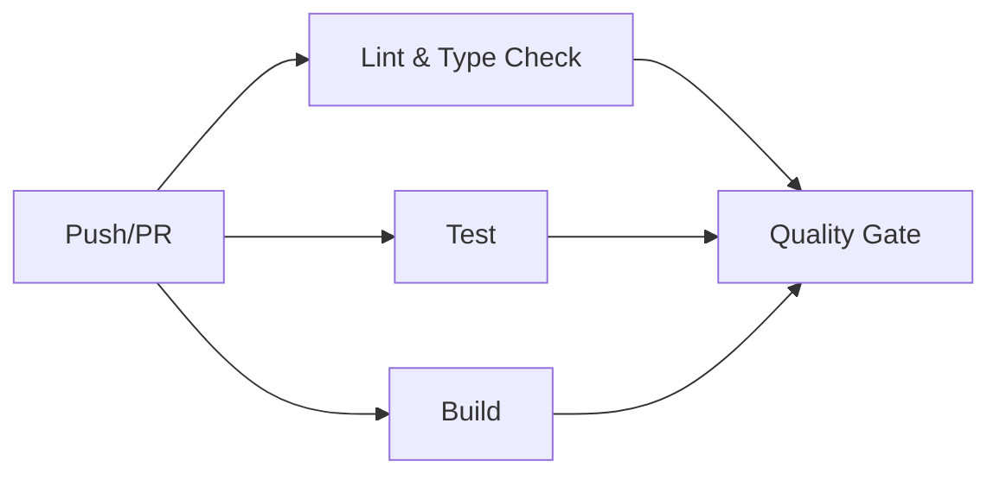
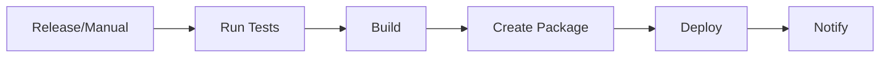

# GitHub Actions Workflows Documentation

This document describes the GitHub Actions workflows and automation configured for the AuctionAssistant project.

## Overview

The project uses GitHub Actions for continuous integration, automated testing, code quality checks, and deployment automation. Additionally, Dependabot is configured for automated dependency updates.

## Workflows

### 1. Continuous Integration (CI) - `ci.yml`

**Trigger:** Runs on every push and pull request to `main` and `develop` branches.

**Purpose:** Ensures code quality and correctness through automated checks.

#### Jobs

##### Lint and Type Check
- Runs ESLint to check code quality
- Validates Prettier formatting
- Performs TypeScript type checking
- Tests on Node.js versions 18, 20, and 22

##### Test
- Runs the Jest test suite
- Generates code coverage reports
- Uploads coverage to Codecov (on Node.js 20)
- Tests on Node.js versions 18, 20, and 22

##### Build
- Compiles TypeScript to JavaScript
- Verifies build output exists
- Uploads build artifacts (on Node.js 20)
- Tests on Node.js versions 18, 20, and 22

##### Quality Gate
- Final job that requires all other jobs to pass
- Provides a single status check for branch protection rules

#### CI Workflow Steps



### 2. Deploy - `deploy.yml`

**Trigger:** 
- Automatically on release publication
- Manually via workflow_dispatch with environment selection

**Purpose:** Automates deployment to staging or production environments.

#### Jobs

##### Deploy
- Runs tests before deployment
- Builds the application
- Creates a deployment package (tarball)
- Uploads deployment artifacts
- Includes placeholder for actual deployment steps

##### Notify
- Sends deployment status notification
- Reports success or failure

#### Deployment Workflow Steps



#### Customizing Deployment

To configure actual deployment, uncomment and modify the deployment step in `.github/workflows/deploy.yml`:

**For AWS:**
```yaml
- name: Configure AWS credentials
  uses: aws-actions/configure-aws-credentials@v4
  with:
    aws-access-key-id: ${{ secrets.AWS_ACCESS_KEY_ID }}
    aws-secret-access-key: ${{ secrets.AWS_SECRET_ACCESS_KEY }}
    aws-region: us-east-1

- name: Deploy to S3
  run: aws s3 sync dist/ s3://your-bucket-name
```

**For Azure:**
```yaml
- name: Deploy to Azure Web App
  uses: azure/webapps-deploy@v2
  with:
    app-name: 'your-app-name'
    publish-profile: ${{ secrets.AZURE_WEBAPP_PUBLISH_PROFILE }}
    package: deployment.tar.gz
```

**For DigitalOcean or VPS:**
```yaml
- name: Deploy via SSH
  uses: appleboy/ssh-action@v1.0.0
  with:
    host: ${{ secrets.HOST }}
    username: ${{ secrets.USERNAME }}
    key: ${{ secrets.SSH_KEY }}
    script: |
      cd /var/www/auctionassistant
      git pull
      npm ci
      npm run build
      pm2 restart auctionassistant
```

**For Heroku:**
```yaml
- name: Deploy to Heroku
  uses: akhileshns/heroku-deploy@v3.13.15
  with:
    heroku_api_key: ${{ secrets.HEROKU_API_KEY }}
    heroku_app_name: "your-app-name"
    heroku_email: "your-email@example.com"
```

## Dependabot Configuration - `dependabot.yml`

**Purpose:** Automatically creates pull requests for dependency updates.

### NPM Dependencies
- **Schedule:** Weekly on Mondays at 9:00 AM
- **Update Limit:** 10 open PRs maximum
- **Version Policy:** Ignores major version updates by default
- **Grouping:**
  - TypeScript ecosystem (typescript, @types/*, ts-*)
  - Code quality tools (eslint, prettier, @typescript-eslint/*)
  - Testing frameworks (jest, supertest, @types/jest, @types/supertest)

### GitHub Actions
- **Schedule:** Weekly on Mondays at 9:00 AM
- **Update Limit:** 5 open PRs maximum
- **Scope:** All workflow actions (actions/checkout, actions/setup-node, etc.)

### Dependabot PR Labels
- `dependencies` - All dependency updates
- `npm` - npm package updates
- `github-actions` - GitHub Actions updates

## Branch Protection Rules (Recommended)

To enforce quality standards, configure branch protection rules in GitHub:

1. Go to **Settings** → **Branches** → **Add rule**
2. Apply to `main` branch
3. Enable:
   - ✅ Require a pull request before merging
   - ✅ Require status checks to pass before merging
     - Select: `Quality Gate`
   - ✅ Require branches to be up to date before merging
   - ✅ Require conversation resolution before merging

## Secrets Configuration

The following secrets should be configured in **Settings** → **Secrets and variables** → **Actions**:

### For Codecov (Optional)
- `CODECOV_TOKEN` - Token for uploading coverage reports

### For Deployment (Configure based on your needs)
- `AWS_ACCESS_KEY_ID` - AWS access key (if deploying to AWS)
- `AWS_SECRET_ACCESS_KEY` - AWS secret key (if deploying to AWS)
- `AZURE_WEBAPP_PUBLISH_PROFILE` - Azure publish profile (if deploying to Azure)
- `SSH_KEY` - SSH private key (if deploying to VPS)
- `HOST` - Server hostname (if deploying to VPS)
- `USERNAME` - SSH username (if deploying to VPS)
- `HEROKU_API_KEY` - Heroku API key (if deploying to Heroku)

## Environment Configuration

For deployment workflow, configure environments in **Settings** → **Environments**:

1. Create `staging` environment
2. Create `production` environment
3. Add environment protection rules:
   - Required reviewers
   - Wait timer
   - Environment secrets

## Monitoring and Maintenance

### Viewing Workflow Runs
- Go to **Actions** tab in GitHub repository
- View all workflow runs, logs, and artifacts
- Download build artifacts if needed

### Dependabot PR Management
- Review Dependabot PRs regularly
- Test grouped updates thoroughly
- Approve and merge compatible updates
- Close or postpone breaking updates

### Troubleshooting Failed Workflows

**If linting fails:**
```bash
npm run lint:fix
npm run format
```

**If tests fail:**
```bash
npm test
# Review and fix failing tests
```

**If build fails:**
```bash
npm run build
# Check TypeScript errors and fix
```

**If type checking fails:**
```bash
npm run type-check
# Review TypeScript errors
```

## CI/CD Best Practices

1. **Always run tests locally** before pushing
2. **Keep dependencies up to date** via Dependabot
3. **Review all Dependabot PRs** before merging
4. **Monitor workflow execution times** and optimize if needed
5. **Use semantic versioning** for releases
6. **Tag releases** properly for deployment workflow
7. **Keep secrets secure** and rotate regularly
8. **Test deployment** in staging before production

## Additional Resources

- [GitHub Actions Documentation](https://docs.github.com/en/actions)
- [Dependabot Documentation](https://docs.github.com/en/code-security/dependabot)
- [Node.js Best Practices](https://github.com/goldbergyoni/nodebestpractices)
- [TypeScript Handbook](https://www.typescriptlang.org/docs/)

## Support

For issues or questions about the CI/CD setup:
1. Check workflow logs in the Actions tab
2. Review this documentation
3. Open an issue in the repository
